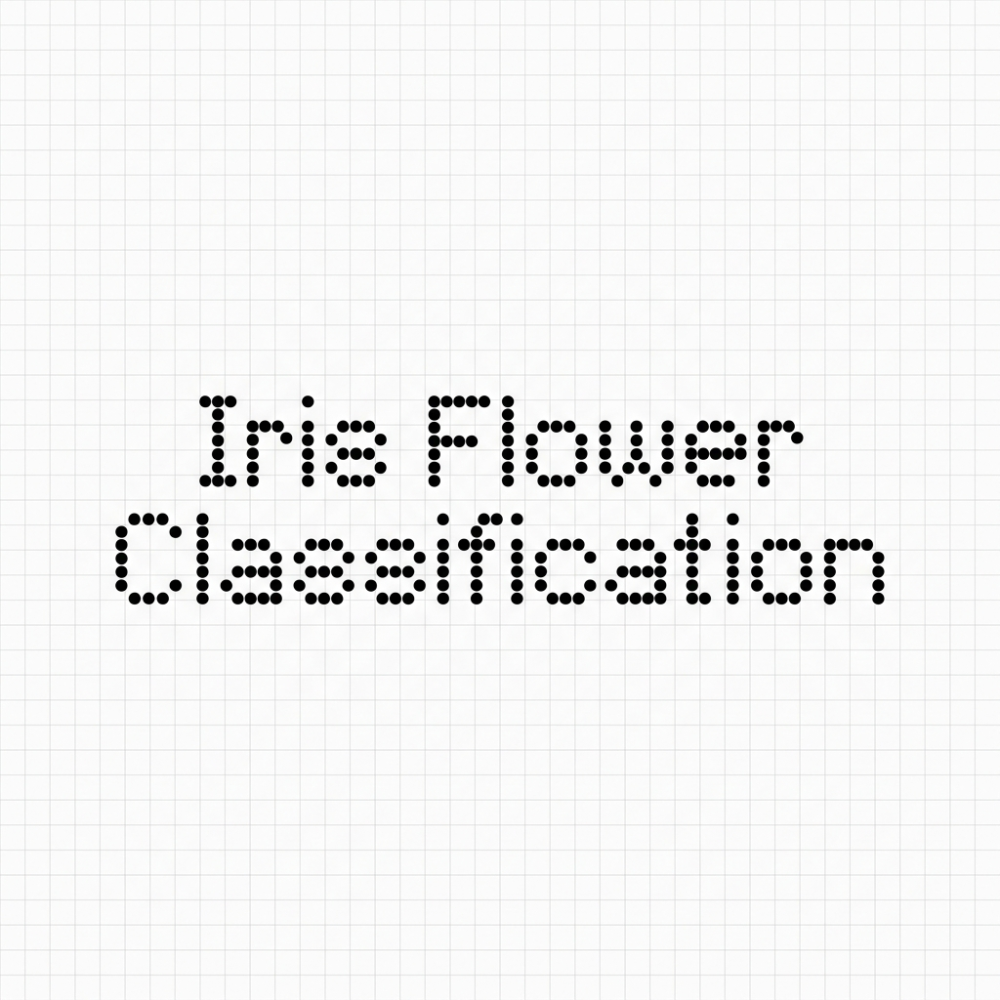
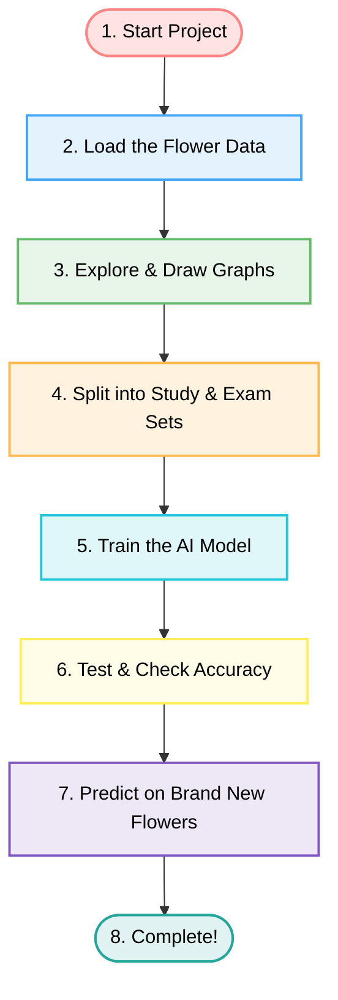
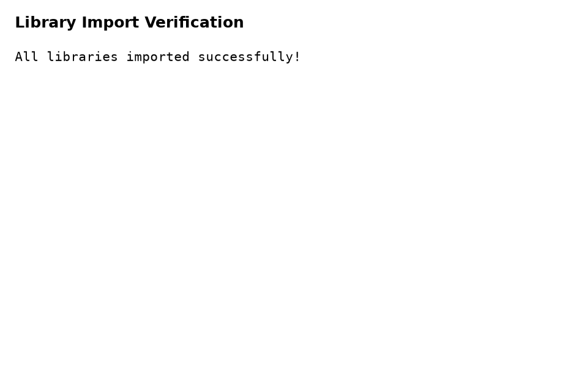
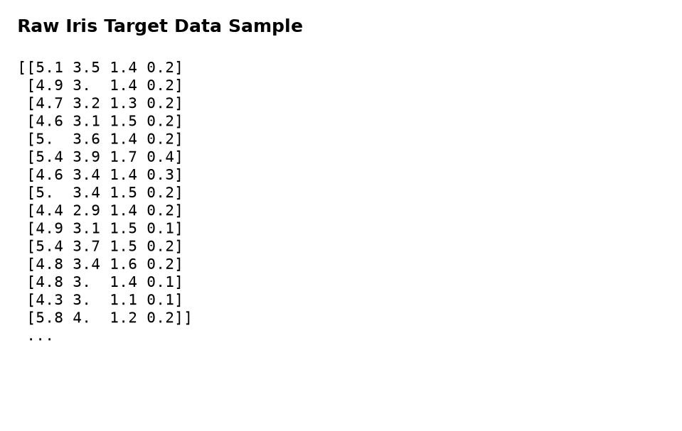
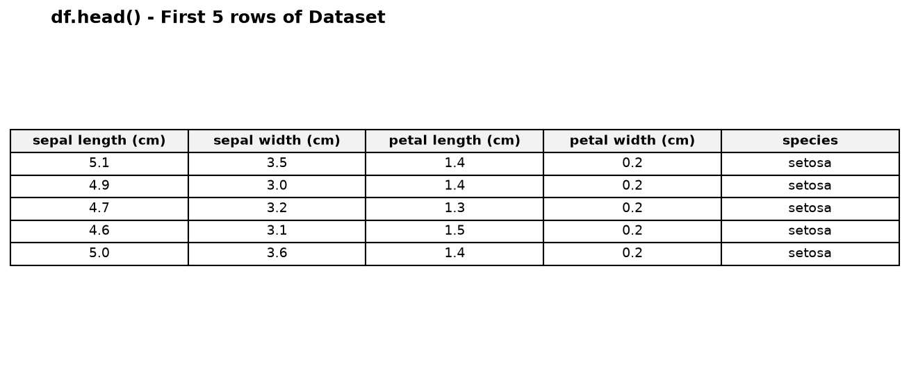
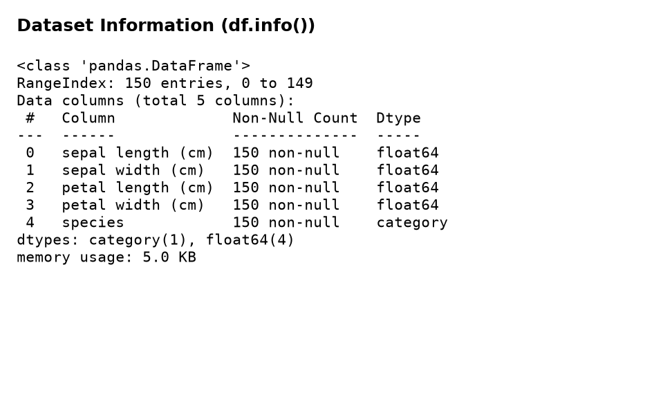
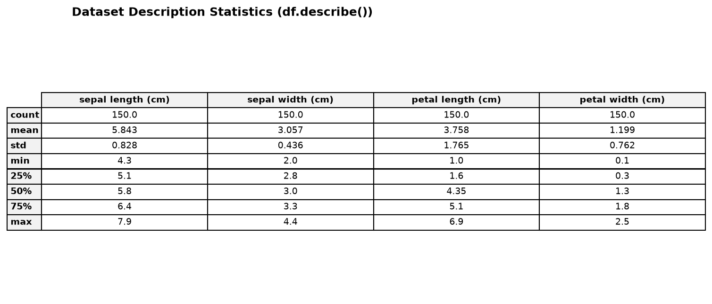
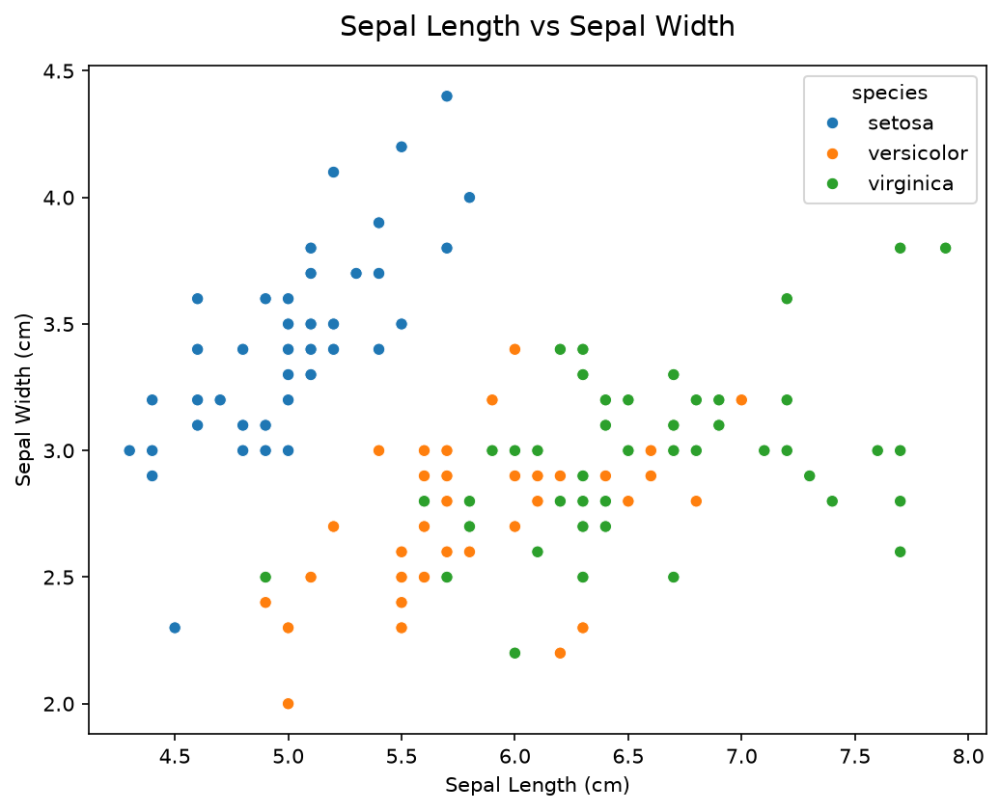
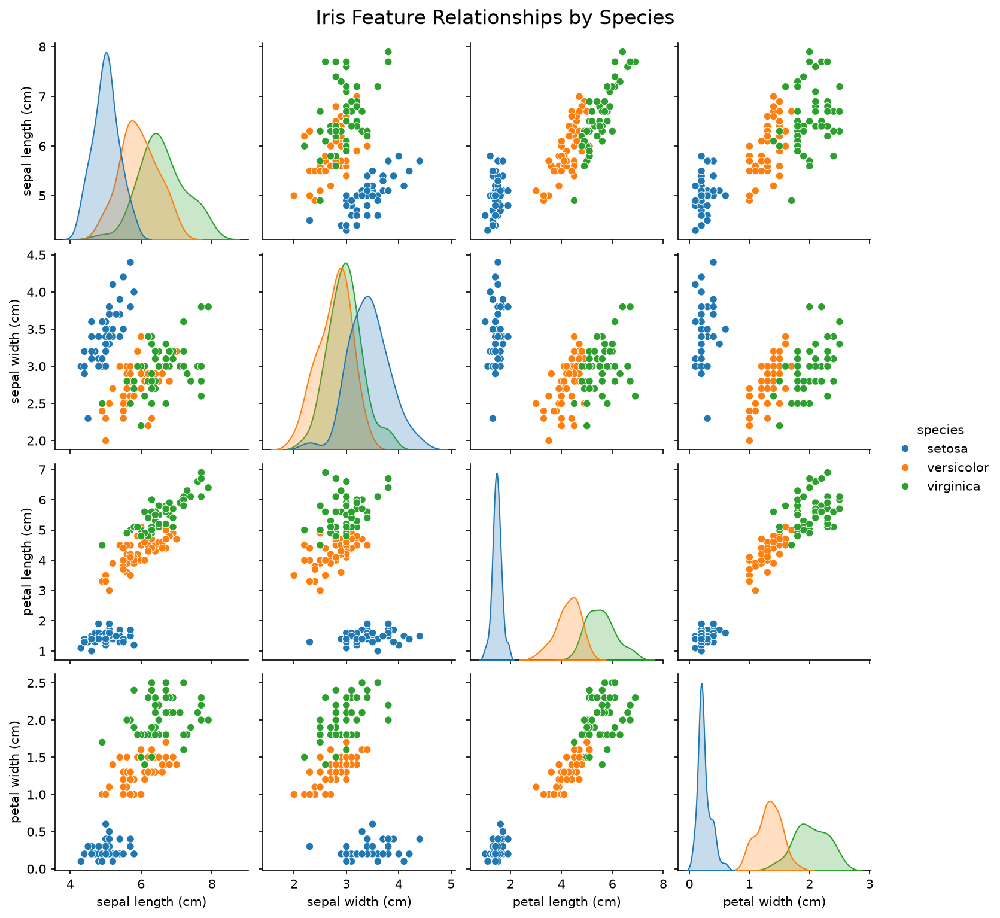

# 🌸 Iris Flower Classification

<p align="center">
  
</p>

Welcome! This project is a friendly, step-by-step guide to teaching a computer how to identify different species of **Iris flowers** using **Machine Learning**. 

This guide is written in very simple English, so even if you have no background in computer science or programming, you will easily understand everything!

---

## 👨‍💻 Author
*   **Name:** CH D S S S BABA
*   **Project:** Machine Learning with Python Internship Project

---

## 📚 What is this Project About?

Imagine you have three different types of Iris flowers: **Setosa**, **Versicolor**, and **Virginica**. They look very similar, but they have different sizes.

We want to build a computer program that can look at the size of a new flower and instantly guess its correct type.

To do this, we measure four parts of the flower:
1.  **Sepal Length** (the length of the green outer leaves)
2.  **Sepal Width** (the width of the green outer leaves)
3.  **Petal Length** (the length of the colorful inner petals)
4.  **Petal Width** (the width of the colorful inner petals)

---

## 📈 The Visual Workflow (How it Works)

Here is a simple flow chart showing exactly how the computer learns and makes guesses:



---

## 📂 Project Structure
```text
.
├── assets/
│   ├── images/
│   │   └── iris_flower_classification.png                  <-- Our minimalist banner
│   └── screenshots/                                        <-- Visual graphs and cell outputs
│       ├── Dataset_description.png
│       ├── Dataset_info.png
│       ├── accuracy and confusion matrix.png
│       ├── classification report.png
│       ├── confusion matrix heatmap.png
│       ├── df_head.png
│       ├── feature correlation heatmap.png
│       ├── iris_data.png
│       ├── library_test.png
│       ├── model prediction with unknown data.png
│       ├── model prediction.png
│       ├── model training.png
│       ├── pairplot.png
│       ├── scatterplot.png
│       └── training and test data.png
├── docs/
│   └── Iris_Flower_Classification_Report.pdf               <-- Detailed project report document
├── src/
│   ├── classify_iris.py                                     <-- The main Python program
│   └── Iris_Flower_Classification.ipynb                     <-- Interactive Jupyter Notebook
├── .gitignore
├── README.md                                               <-- This instruction guide
└── requirements.txt                                        <-- Libraries to install
```

---

## 🚀 How to Run it Yourself

### Option A: Run the Python script
1.  **Install the Libraries:**
    Open your command prompt or terminal and run:
    ```bash
    pip install -r requirements.txt
    ```
2.  **Run the script:**
    ```bash
    python src/classify_iris.py
    ```

### Option B: Run the Interactive Jupyter Notebook
1.  Open the file **`src/Iris_Flower_Classification.ipynb`** in VS Code, Jupyter Lab, or Google Colab.
2.  Run the cells step-by-step to view the interactive plots and predictions instantly!

---

## 📊 Step-by-Step Walkthrough with Screenshots

Below is the complete execution pipeline showing what the program does at every stage, accompanied by the generated screenshot output:

### 1. Library Testing (`library_test.png`)
Verifies that all required packages (`pandas`, `matplotlib`, `seaborn`, `sklearn`) are installed properly.
<p align="center">
  
</p>

### 2. Raw Dataset (`iris_data.png`)
Displays a sample of the raw numerical measurements loaded directly from the Iris dataset.
<p align="center">
  
</p>

### 3. Data Frame Head (`df_head.png`)
Shows the first few rows of the cleaned table with the column names and categorical species labels.
<p align="center">
  
</p>

### 4. Dataset Information (`Dataset_info.png`)
Shows details about the columns, row count, data types, and check for missing/null values.
<p align="center">
  
</p>

### 5. Dataset Description (`Dataset_description.png`)
Generates descriptive statistical summaries (mean, standard deviation, min, max) of the features.
<p align="center">
  
</p>

### 6. Scatterplot (`scatterplot.png`)
Plots sepal length against sepal width to visually group the three flower types.
<p align="center">
  
</p>

### 7. Pairplot (`pairplot.png`)
Displays scatter plots for every combination of measurements.
<p align="center">
  
</p>

### 8. Feature Correlation Heatmap (`feature correlation heatmap.png`)
Highlights strong relationships between different features using warm and cool colors.
<p align="center">
  
</p>

### 9. Training and Test Data Splitting (`training and test data.png`)
Shows the dimensions of the split training set (120 samples) and testing set (30 samples).
<p align="center">
  
</p>

### 10. Model Training (`model training.png`)
Confirms successful training of the Logistic Regression model.
<p align="center">
  
</p>

### 11. Model Prediction on Test Set (`model prediction.png`)
Shows the predicted species classifications for the first 10 unseen test samples.
<p align="center">
  
</p>

### 12. Accuracy Score (`accuracy and confusion matrix.png`)
Calculates the final accuracy percentage of the model, which is 100%.
<p align="center">
  
</p>

### 13. Confusion Matrix Heatmap (`confusion matrix heatmap.png`)
Shows the counts of correct predictions versus incorrect predictions.
<p align="center">
  
</p>

### 14. Classification Report (`classification report.png`)
Shows precision, recall, and f1-score performance metrics for all three species.
<p align="center">
  
</p>

### 15. Predictions with Unknown/New Data (`model prediction with unknown data.png`)
Shows the predicted species for three brand new flower samples:
*   Sample 1 `[5.1, 3.5, 1.4, 0.2]`: **Setosa**
*   Sample 2 `[6.0, 2.9, 4.5, 1.5]`: **Versicolor**
*   Sample 3 `[6.7, 3.0, 5.8, 2.2]`: **Virginica**
<p align="center">
  
</p>